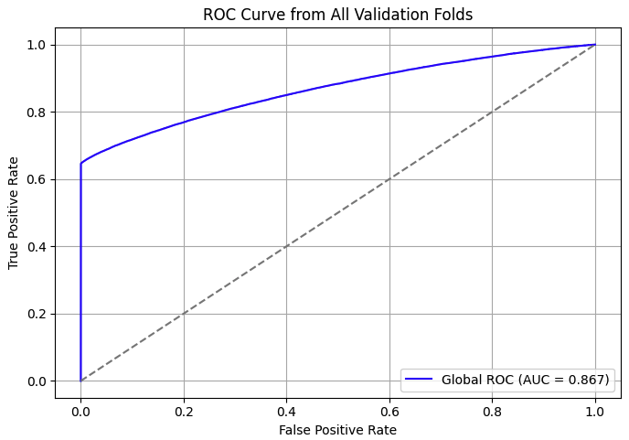

## 🚗 Car Insurance Claim Prediction with XGBoost

This project develops an XGBoost-based predictive model to identify high-risk drivers who are likely to file car insurance claims. The model leverages domain-specific features from driver demographics, vehicle details, regional conditions, and driving behavior.

---

### 🌟 Project Overview

#### Objective:

Predict whether a driver will make a claim (binary classification), enabling data-driven risk stratification and personalized insurance management.

#### Business Applications:

💰 Risk-based Premium Adjustment
Adjust insurance pricing based on predicted claim probabilities

🛡️ Tailored Underwriting Rules
Define acceptance thresholds or policy conditions based on risk profiles

🚘 Proactive Behavioral Interventions
Identify high-risk drivers early and offer training, incentives, or personalized feedback to reduce claim likelihood

---

### 📊 Dataset Overview

Training set: 590,000+ rows

Test set: 890,000+ rows

Target variable: target (1 = made a claim, 0 = no claim)

---

### 🚀 Quick Start

To get started quickly, follow these steps:


#### 1. Clone the repository

```bash
git clone https://github.com/Feiyingdai/Car-Insurance-Claim-Prediction.git
cd Car-Insurance-Claim-Prediction
```


#### 2. Install required packages

```bash
pip install -r requirements.txt
```

Or install manually:

```bash
pip install pandas numpy scikit-learn xgboost optuna shap matplotlib seaborn
```

#### 3. Run the notebook

Open the notebook using Jupyter or Colab:

```bash
jupyter notebook car_insurance_claim_prediction.ipynb
```


#### 4. Use the sample dataset

A small sample dataset `sample_data.csv` (100 rows) is included in the `data/` folder for testing and quick experimentation.

```python
# Load sample data
import pandas as pd
df = pd.read_csv('data/sample_data.csv')
df.head()
```
---


### 🧩 Feature Groups

**Individual Info**

ps_ind_* : Age group, license type, profession, training participation...

**Car Features**

ps_car_* : Vehicle type, battery health, charging data, Autopilot...

**Region Features**

ps_reg_* : Climate, traffic, charger density...

**Driving Behavior**

ps_calc_* : Acceleration/braking aggressiveness, high mileage behavior...

---

### 📦 Project Phases & To-Do List
#### ✅ Phase 1: Data Preparation & Cleaning

- Balance target class using techniques like Borderline SMOTE

- Handle missing values and outliers

- Transform skewed variables if needed

#### ✅ Phase 2: Feature Engineering

- Smoothed target encoding with noise

- Polynomial and interaction features

- Gain/weight-based feature selection

#### ✅ Phase 3: Model Development & Tuning

- Model: XGBoost (with L1/L2 regularization)

- Nested Optuna tuning (XGBoost hyperparameters & target encoding hyperparameters)

- 10-fold stratified cross-validation

#### ✅ Phase 4: Interpretation & Risk Stratification

- AUC Score, ROC Curve

- KS Score and Probability thresholds for claim risk segmentation of validation dataset

- Recall of validation dataset

- SHAP Feature Importance

#### ✅ Phase 5: Prediction of Test Dataset

- Final test set prediction is averaged over 10 models (from CV folds)

---

### 🌟 Final Deliverables

| Deliverable        | Description                                           |
|--------------------|-------------------------------------------------------|
| Trained Model      | XGBoost model with tuned hyperparameters             |
| Feature Set        | Finalized engineered feature matrix                  |
| Evaluation         | AUC Score, ROC Curve, KS score, Recall              |
| Prediction         | Out-of-sample prediction on test dataset             |


---

### 📊 Results Summary

| Metric                     | Result     |
|----------------------------|------------|
| AUC                        | 0.86       |
| High-Risk Driver Recall    | 65%        |
| KS Score                   | 0.64       |

---

### Model Evaluation & Business Interpretation

**1. 📈 Cross-Validation Results (10 Folds)**

| Fold | AUC   |
|------|-------|
| 1    | 0.8651 |
| 2    | 0.8652 |
| 3    | 0.8659|
| 4    | 0.8685 |
| 5    | 0.8767|
| 6    | 0.8669 |
| 7    | 0.8670|
| 8    | 0.8669 |
| 9    | 0.8619 |
| 10   | 0.8638 |
| **Avg** | **0.8666** |

**KS Score (avg):** 0.64  
**Recall at KS Threshold (avg):** 0.65

**2. 📈 ROC Curve**

Model performance across validation folds:



   
**3. 📌 Business Interpretation**

By stratifying drivers based on predicted risk scores:

- Optimal threshold (KS=0.64) achieved recall of 65% for High-risk segment.

- This allows insurers to take proactive measures such as adjusting premiums, requiring additional documentation, or offering driving behavior incentives.

---

### 📦 Tech Stack

Language: Python 3.10+

Modeling: XGBoost 1.7+

Tuning: Optuna 3.0+

Libraries: pandas, scikit-learn, seaborn, matplotlib

---

### 📁 Project Structure

```
.
├── data/                   # Raw and processed datasets (not uploaded)
├── notebooks/              # Modeling and feature engineering notebooks
├── image/                  # Images for modeling output
├── README.md               # Project documentation
└── requirements.txt        # Dependency list
```

---

### 🚫 Notes

Dataset not uploaded due to privacy constraints.

A small sample dataset **sample_data.csv** is available in data/ folder for reproducibility.

---

### 📄 License & Contribution

**📝 License**

MIT License

**👥 Contributors**

This project was developed by Feiying Dai, as part of my personal portfolio to demonstrate risk modeling in real-world insurance applications.

